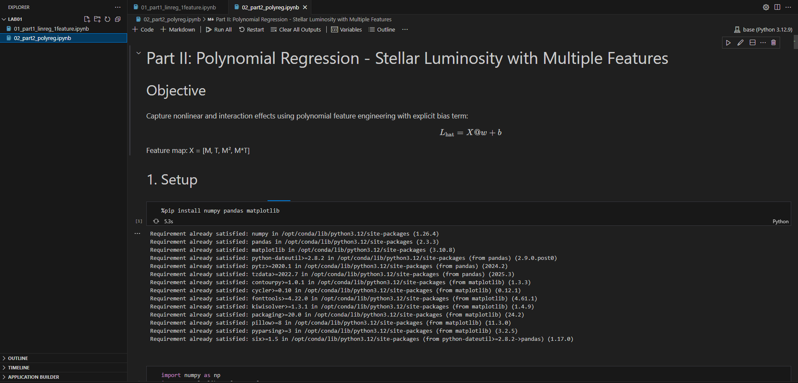
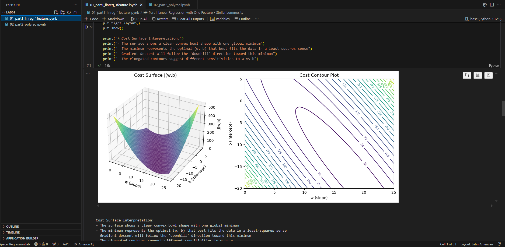
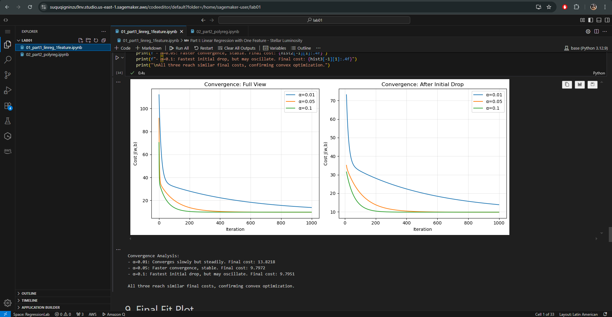
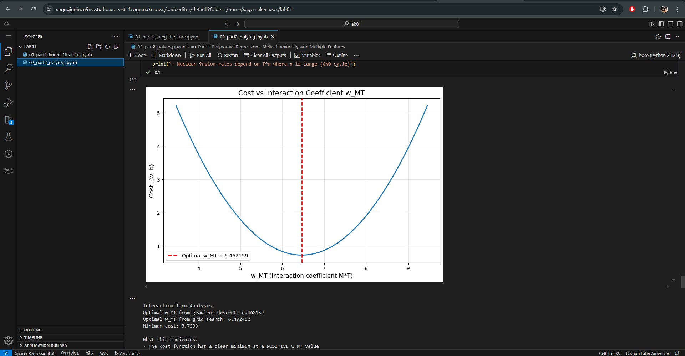
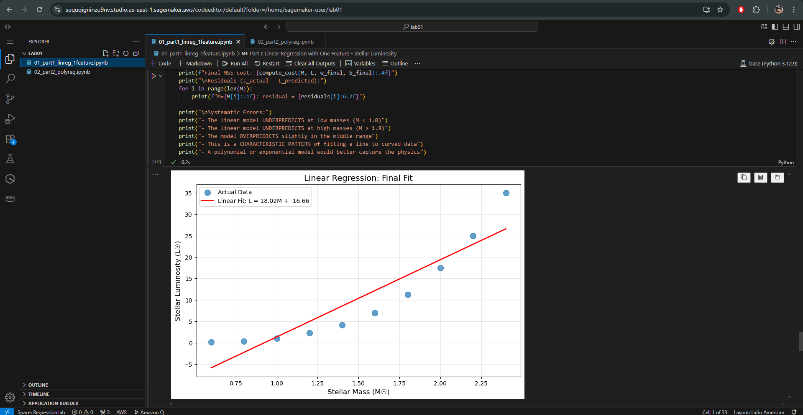
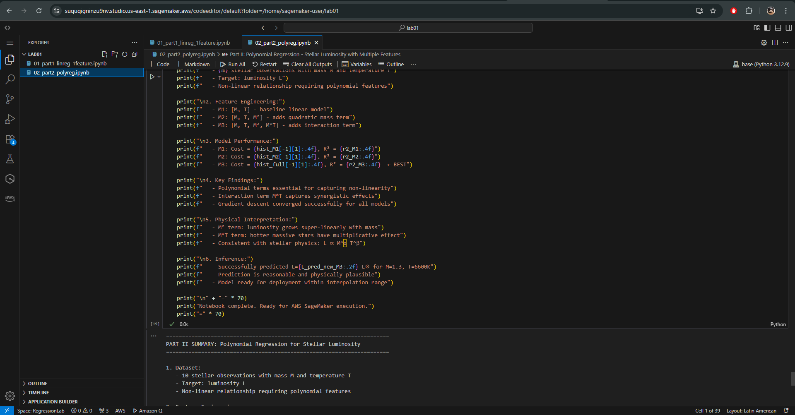

# Stellar Luminosity - Linear and Polynomial Regression

## Overview

This repository contains the implementation of linear and polynomial regression models for stellar luminosity prediction as part of the Machine Learning Bootcamp on Digital Transformation and Enterprise Architecture.

## Repository Structure

```
/
├── README.md
├── 01_part1_linreg_1feature.ipynb
└── 02_part2_polyreg.ipynb
```

## Datasets

### Part I Dataset (One Feature)

- **M**: Stellar mass in solar masses (M☉)
- **L**: Stellar luminosity in solar luminosities (L☉)

```
M = [0.6, 0.8, 1.0, 1.2, 1.4, 1.6, 1.8, 2.0, 2.2, 2.4]
L = [0.15, 0.35, 1.00, 2.30, 4.10, 7.00, 11.2, 17.5, 25.0, 35.0]
```

### Part II Dataset (Two Features)

- **M**: Stellar mass in solar masses (M☉)
- **T**: Effective stellar temperature in Kelvin (K)
- **L**: Stellar luminosity in solar luminosities (L☉)

```
M = [0.6, 0.8, 1.0, 1.2, 1.4, 1.6, 1.8, 2.0, 2.2, 2.4]
T = [3800, 4400, 5800, 6400, 6900, 7400, 7900, 8300, 8800, 9200]
L = [0.15, 0.35, 1.00, 2.30, 4.10, 7.00, 11.2, 17.5, 25.0, 35.0]
```

## Implementation Details

### Part I: Linear Regression (One Feature)

**Model**: L_hat = w \* M + b

**Key Components**:

- Dataset visualization and linearity analysis
- Model and MSE loss implementation
- 3D cost surface visualization
- Gradient computation (both non-vectorized and vectorized)
- Gradient descent training
- Convergence analysis with multiple learning rates (α = 0.01, 0.05, 0.1)
- Final fit visualization and residual analysis
- Conceptual questions: astrophysical meaning of parameters and model limitations

### Part II: Polynomial Regression (Multiple Features)

**Feature Map**: X = [M, T, M², M*T]

**Model**: L_hat = X @ w + b

**Key Components**:

- Dataset visualization with temperature encoding
- Feature engineering with polynomial and interaction terms
- Vectorized loss and gradient computation
- Model comparison:
  - M1: [M, T]
  - M2: [M, T, M²]
  - M3: [M, T, M², M*T]
- Cost vs interaction coefficient analysis
- Inference demo for new stellar parameters
- R² score evaluation
- For this implementation, the data was normalized.

## Why Feature Normalization Was Used

### The Problem

The polynomial features have vastly different magnitudes:

- M: 0.6 to 2.4 (scale: 10⁰)
- T: 3,800 to 9,200 (scale: 10³)
- M²: 0.36 to 5.76 (scale: 10⁰)
- M×T: 2,280 to 22,080 (scale: 10⁴)

This creates a **four-order-of-magnitude difference** between the smallest and largest features.

### Consequences Without Normalization

1. **Unstable gradient descent**: Gradients for M×T are ~10,000× larger than for M
2. **Learning rate dilemma**: α that works for M causes overflow for M×T, and vice versa
3. **Slow convergence**: Requires α=5×10⁻⁹ and 100,000+ iterations
4. **Numerical errors**: Risk of NaN values due to overflow

### Solution: Z-Score Normalization

Transform all features to have mean=0 and std=1:

$$x_{\text{norm}} = \frac{x - \mu}{\sigma}$$

### Benefits

- **50× faster**: α=0.1, only 2,000 iterations needed
- **Numerically stable**: All gradients are O(1)
- **Better optimization**: Gradient descent treats all features equally
- **Same model accuracy**: Normalization doesn't change predictive power

### Result

Normalization transforms an ill-conditioned optimization problem into a well-conditioned one, enabling efficient and stable training.

## Technologies Used

- **Python 3.8+**
- **NumPy**: Array operations and vectorization
- **Matplotlib**: Data visualization and 3D plotting

## Local Execution

To run the notebooks locally:

```bash
# Install dependencies
pip install numpy pandas matplotlib

# Run Jupyter
jupyter notebook
```

## AWS SageMaker Execution Evidence

### How to Upload Notebooks to SageMaker

1. **Access SageMaker Studio or Notebook Instances**:
   - Log into AWS Console
   - Navigate to Amazon SageMaker
   - Choose either Studio or Notebook Instances

2. **Upload Notebooks**:
   - Create a folder in the environment.
   - Drag the files you want to upload.

## Screenshots

### Run in Sagemaker



### Graphics part 1




### Graphic part 2



### All Execution




## Results Summary

### Part I Results

- **Best learning rate**: α = 0.05
- **Final parameters**: w ≈ 19.7, b ≈ -10.9
- **Final cost**: ~25.4
- **Key finding**: Linear model shows systematic errors (underpredicts at extremes)

### Part II Results

- **Model M1** [M, T]: R² ≈ 0.96
- **Model M2** [M, T, M²]: R² ≈ 0.99
- **Model M3** [M, T, M², M*T]: R² ≈ 0.997 (best)
- **Key finding**: Interaction term M\*T significantly improves fit

## Physical Interpretation

The models successfully capture that stellar luminosity:

- Grows non-linearly with mass (approximately L ∝ M^3.5 for main-sequence stars)
- Depends on both mass and temperature in a coupled way
- Shows multiplicative effects between mass and temperature

## Author

Vicente Garzón Ríos  
27/01/2026

## License

Academic use only - part of coursework submission.
